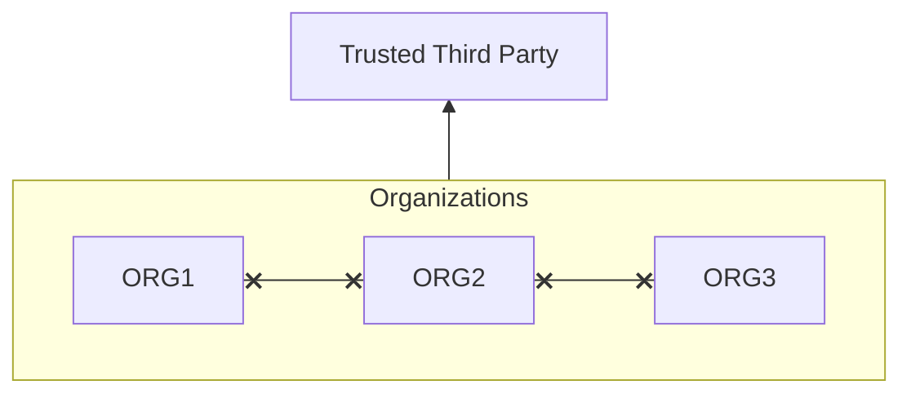

# About
---
- [[#Context-Aware]]

# Context-Aware
---
- Process that checks the user's or the system's attributed prior to allowing it to connect
- Common implements are limiting based on
	- Time/Day
	- Geographic area
- Example
	- A small US company blocking any non US connections coming in or outside of normal business hours

# Single Sign-On (SSO)
---
- The ability to log in once but gain access to multiple systems without being asked to log in again
- A default user profile for each user is created and linked with all of the resources needed
- A user will have one account that has access to all of the services rather than an account for each individual one
- Adding [[Authentication#Multi-Factor Authentication|Multi-Factor Authentication]] is common and recommended
- Makes it quicker and easier to assign resources and setup a user
- However a breach of an SSO account/system can cause a big security breach

# Federated Identity Management (FIdM)

## About
---
- A single Identity is created for a user and shared with all of the other organization in a federation
- Common sets of standards agreed on
- Each organization can delegate the level of access the other organizations and the users/groups within them
- Models
	- [[#Cross-Certification]]
	- [[#Trusted Third-Party]]

## Cross-Certification
---
- Utilize a web of trust between organizations where each organization certifies the others in a federation
- Typically good for smaller organizations between 5 - 10
- Comparable to a full mesh network model

```ad-example
title: Cross-Certification Model
collapse:close
![[FedModelEx1.png]]
```

## Trusted Third-Party
---
- Organizations are able to place their trust in a single third-party which manages the verification and certification for the other organizations
- AKA "Bridge Model"
- Considered to be more efficient
- Similar to how a Certificate Authority is used



# Objectives
---
- [[Objectives#2.4 - Summarize authentication and authorization design concepts|2.4 - Summarize authentication and authorization design concepts]]
- [[Objectives#3.5 - Given a scenario, implement secure mobile solutions|3.5 - Given a scenario, implement secure mobile solutions]]
- [[Objectives#3.8 - Given a scenario, implement authentication and authorization solutions|3.8 - Given a scenario, implement authentication and authorization solutions]]
- [[Objectives#3.9 - Given a scenario, implement public key Infrastructure|3.9 - Given a scenario, implement public key Infrastructure]]

# TODO (Delete when done)
---
- [ ] Added vocab
- [ ] Added and linked objectives in document
- [ ] Linked objectives back to document
- [ ] Linked any relevant backlinks to and from document