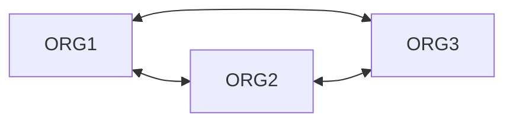
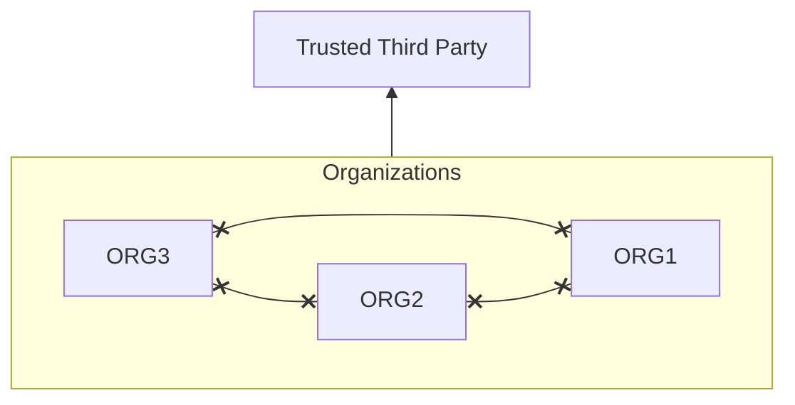

# About
---
- [[#Context-Aware]]
- [[#Single Sign-On (SSO)]]
- [[#Federated Identity Management (FIdM)]]
- See also
	- [[Authentication]]
	- [[SAML Cont.]]
	- [[OAUTH Cont.]]
	- [[OpenID Cont.]]

# Context-Aware
---
- Process that checks the user's or the system's attributed prior to allowing it to connect ^43dd3c
- Common implements are limiting based on
	- Time/Day
	- Geographic area
- Example
	- A small US company blocking any non US connections coming in as well as any login outside of normal business hours

# Single Sign-On (SSO)
---
- The ability to log in once but gain access to multiple systems without being asked to log in again ^e82e39
- A default user profile for each user is created and linked with all of the resources needed
- A user will have one account that has access to all of the services rather than an account for each individual one
- Adding [[Authentication#Multi-Factor Authentication (MFA)|Multi-Factor Authentication (MFA)]] is common and recommended
- Makes it quicker and easier to assign resources and setup a user
- However a breach of an SSO account/system can cause a big security breach

# Federated Identity Management (FIdM)

## About
---
- A single [[Identity]] is created for a user and shared with all of the other organization in a [[#^b0897d|Federation]] ^1ef356
- Common sets of standards agreed on
- Each organization can delegate the level of access the other organizations and the users/groups within them
- Models
	- [[#Cross-Certification]]
	- [[#Trusted Third-Party]]
- Seer also
	- [[Identity]]

## Cross-Certification
---
- Utilize a web of trust between organizations where each organization certifies the other is in a [[#^b0897d|Federation]]
- Typically good for smaller organizations between 5 - 10
- Comparable to a full mesh network model

## Trusted Third-Party
---
- Organizations are able to place their trust in a single third-party which manages the verification and certification for the other organizations
- AKA "Bridge Model"
- Considered to be more efficient
- Similar to how a Certificate Authority is used

# Security Assertion Markup Language (SAML)
---
- [[Trusted Firmware#Attestation|Attestation]] model built upon [[XML Vulnerabilities|XML]] used to share [[#Federated Identity Management (FIdM)]] information between systems using [[#Single Sign-On (SSO)]] ^9fb657
- Process
	- Uses an assertation ticket provided to the user trying to authenticate
	- User then passes that ticket back to the web server in order to complete authentication
- Standardization of [[#Single Sign-On (SSO)]]
- OASIS Security Assertion Markup Language is currently the most used standard for implementing federated identity processes
- SAML considered an older method and has less mobile system (phones) support
- More difficult to setup than [[#OpenID]] but more efficient
- Typically specific to a user

# OpenID
---
- An open standard and decentralized protocol that is used to authenticate users in a [[#Federated Identity Management (FIdM)]] system ^fc7bbb
- User logs into an [[#^5e1700|Identity Provider (IP/IdP)]]
- That account is then used at [[#^82c48e|Relying Parties (RP)]]
- Is easier to setup vs. [[#Security Assertion Markup Language (SAML]] but it is less efficient
- Is more modern and becoming the popular standard
- Typically specific to an application
	- Built on top of [[OAUTH Cont.|OAUTH]] 2.0
	- Supported on most mobile systems (phones)
- Uses an OpenID Provider (OP) ^bbf481
	- An [[#^5e1700|IdP]] equivalent for OpenID  ^376285
- Example
	- Websites, other than Google, where you can log in with a Google account

# Vocab
---
- Federation ^6e2722
	- A collection of distinct organizations that agree to allow users to use one set of credentials for authentication and authorization purposes ^b0897d
	- The identity used by the users across organizations is called a <u>federated identity</u>
- Identity Provider (IP/IdP) ^5e1700
	- The [[#^82c48e|Service Provider]] that also manages the authentication and authorization process on behalf of the other systems in the federation ^f4cb53
- Relying Parties (RP)/Service Provider (SP) ^8af39b
	- The system entity that provides service to the [[#^d0e955|Principal]] or other entities in the [[#^b0897d|Federation]] ^82c48e
- Principal/Subject ^d513a9
	- The end user who requests service from a [[#^82c48e|Service Provider]] and whose identity can be authenticated ^d0e955
- Assertion ^080278
	- The communication of security information about a [[#^d513a9|Principal/Subject]] in the form of a statement ^534c47
	- The information produced by the authentication authority, such as an [[#^5e1700|Identity Provider]] ^2cb860
	- It is usually provided to the [[#^82c48e|Relying Party]] to allow the user to access its resources
	- The assertion proves that the user has been authenticated and includes additional user attributes and authorization information

# Objectives
---
- [[Objectives#2.4 - Summarize authentication and authorization design concepts|2.4 - Summarize authentication and authorization design concepts]]
- [[Objectives#3.7 - Given a scenario, implement identity and account management controls|3.7 - Given a scenario, implement identity and account management controls]]
- [[Objectives#3.8 - Given a scenario, implement authentication and authorization solutions|3.8 - Given a scenario, implement authentication and authorization solutions]]
- [[Objectives#3.9 - Given a scenario, implement public key Infrastructure|3.9 - Given a scenario, implement public key Infrastructure]]