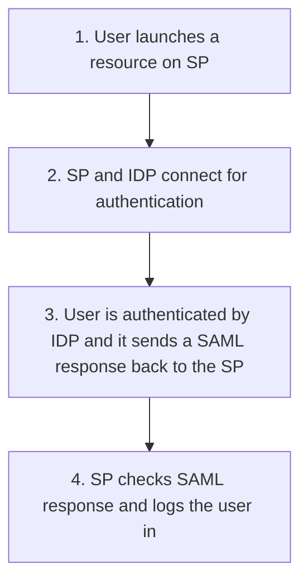

# About
---
- See also
	- [[Authentication Models]]

# SAML Entities
---
- Involves two entities
	- Assertion party/SAML authority
		- The entity that produces the [[Authentication Models#^080278|Assertion]]
		- The [[Authentication Models#^5e1700|Identity Provider]]
	- SAML [[Authentication Models#^8af39b|Relying Party]]
		- The entity that uses the [[Authentication Models#^080278|Assertion]] to make access decisions

# SAML Building Blocks
---
- SAML [[Authentication Models#^080278|Assertion]]
	- Contains <u>information about the user</u>
	- Example
		- User A, who has the email address usera@domain.com, authenticated via username and password, is a platinum member, and is authorized for a 10 percent discount
- SAML Protocol
	- Defines the <u>protocols used to transfer assertion messages</u>
- SAML Binding
	- Includes <u>information on how lower-level protocols</u> (such as HTTP or SOAP) <u>transport SAML protocol messages</u>
- SAML Profile
	- Combinations of assertions, protocols, and bindings for specific use cases
	- Example
		- Web Browser [[Authentication Models#Single Sign-On (SSO)|Single Sign-On]], Identity Provider Discovery, and Enhanced Client and Proxy (ECP).

```ad-example
title: SAML Building Blocks
collapse:close
![[SAMLBuildingBlocksEx1.png]]
```

# SAML Assertions Parts
---
- Authentication statement
	- Includes <u>the result of the authentication</u> and additional information such as the authentication method, timestamps, and so on
- Attribute statement
	- Includes <u>attributes about</u> the [[Authentication Models#^d513a9|Principal]]
- Authorization statement
	- Includes information on <u>what</u> the [[Authentication Models#^d513a9|Principal]] is <u>allowed to do</u>

# Modes

## IdP Initiated Mode
---
1. <u>User is already authenticated</u> on the [[Authentication Models#^5e1700|IdP]] and requests a service from the [[Authentication Models#^8af39b|SP]] 
	1. Example, by clicking a link on the [[Authentication Models#^5e1700|IdP]] website
2. The [[Authentication Models#^5e1700|IdP]] builds an [[Authentication Models#^080278|Assertion]] that is sent to the [[Authentication Models#^8af39b|SP]] within the user request to the [[Authentication Models#^8af39b|SP]] itself

## SP Initiated Mode
---
1. <u>User initiates</u> an access request to some resource on the [[Authentication Models#^8af39b|SP]]
2. Because the [[Authentication Models#^6e2722|Federated Identity]] is managed by a different [[Authentication Models#^5e1700|IdP]], the [[Authentication Models#^8af39b|SP]] redirects the user to log in at the IdP
3. After the login, the [[Authentication Models#^5e1700|IdP]] sends a SAML assertion back to the [[Authentication Models#^8af39b|SP]]

```ad-example
title: SAML Modes Comparison
collapse:close
![[SAMLModesEx1.png]]
```

# SAML Flow
---


# Objectives
---
- Obj

# TODO (Delete when done)
---
- [ ] Added vocab
- [ ] Added and linked objectives in document
- [ ] Linked objectives back to document
- [ ] Linked any relevant backlinks to and from document