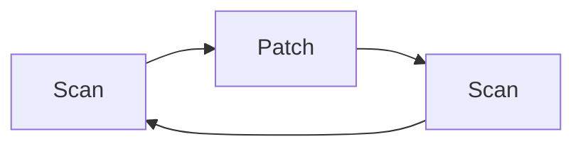

# About
---
- Practice of finding and [[Risk Assessments#Mitigate|Mitigating]] the [[Risk Assessments#Vulnerabilities|Vulnerabilities]] in computers and networks ^03222b
	- Don't confuse with [[#Vulnerability Assessment]]
- See also
	- [[Risk Assessments#Vulnerabilities]]
	- [[Switches#Vulnerabilities]]
	- [[Cloud Security#Vulnerabilities & Concerns]]
	- [[XML Vulnerabilities]]
	- [[Design Vulnerabilities]]
	- [[Vehicular Vulnerabilities]]
	- [[Software Vulnerabilities & Exploits]]
	- [[ICS & SCADA Vulnerabilities]]
	- [[IOT Vulnerabilities]]
	- [[Mitigating ICS & SCADA Vulnerabilities]]
	- [[Premise System Vulnerabilities]]
	- [[Embedded System Vulnerabilities]]

# Vulnerability Assessment

## About
---
- Seeks to identify any issue in a network, application, database, or other systems <u>prior to it being used</u> that might compromise the system ^148cd2
	- Don't confuse with Vulnerability Management
- Formal process to define identify, classify [[Risk Assessments#Vulnerabilities|Vulnerabilities]] in an environment
- Used to forecast effectiveness of proposed countermeasures part of the [[Risk Assessments]]
- Once counter measures are in place a follow up Vulnerability Assessment can be done to truly measure how effective they are 
- [[#Process]] can be known as the "Scan, Patch, Scan" process and be cyclical in nature

## Process
---
1. Scan for [[Risk Assessments#Vulnerabilities|Vulnerabilities]]
	1. Prioritize them
2. [[Updates and Patches|Patch]] any [[Risk Assessments#Vulnerabilities|Vulnerabilities]] found
3. Scan for [[Risk Assessments#Vulnerabilities|Vulnerabilities]] again and repeat process

# Establishing Goals

## About
---
- Before conducting a [[#Vulnerability Assessment]] you need to determine the goal of it
- You then design and set the scope around the goal and relevant [[#Questions]]
- Enables you to be more targeted and better address issues found during the [[#Vulnerability Assessment]]

## Questions
---
1. What is the value of the information that could be discovered if the system is compromised
	1. Helps decided how much and what kind of resources you will allocate
	2. For example, a typical laptop vs a server with confidential information
2. What specific [[Risk Assessments#Threats|Threats]] are you or the system facing
	1. Each system is vulnerable to different types of attacks
	2. For example, Apache vs IIS are different types of web serves but are significantly different when compare to [[Routers]] and [[Switches]]
3. What [[Risk Assessments#Mitigate|Mitigation]] strategies can be deployed to address the issues and [[Risk Assessments#Threats|Threats]]
	1. For example, if you are performing [[Methodologies#Active Scanning|Active Scanning]] and find the same vulnerability on all computers you would want to check the functionality of your server or system responsible for pushing [[Updates and Patches]]
	2. If [[Updates and Patches]] don't yet exist yet, such as in a [[Software Vulnerabilities & Exploits#Zero Day|Zero Day]], scenario you can attempt other strategies
	3. For example, an exploit is found in SMB and a patch is not yet released; So, you use [[Firewalls]] to block usage of that port

# Conducting a Vulnerability Assessment
---
- Typically a scanning technology and program such as Nessus, Qualysguard, and AlienVault
- Allows you to scan the network based on the scope of work
	- [[Methodologies#Passive Scanning|Passive Scanning]] and [[Methodologies#Active Scanning|Active Scanning]]?
- Analyst determines the priority of what [[Switches#Vulnerabilities|Vulnerabilities]] are found
- These are then reported up the organization until these are finally fixed by someone like a system administrator who will install [[Updates and Patches]] or reconfigure something
- Scanning is then done again to ensure that the changes [[Risk Assessments#Vulnerabilities|Vulnerabilities]]
- See also
	- [[#Process]]

# Objectives
---
- [[Objectives#1.7 - Summarize the techniques used in security assessments|1.7 - Summarize the techniques used in security assessments]]
- [[Objectives#4.1 - Given a scenario, use the appropriate tool to assess organizational security|4.1 - Given a scenario, use the appropriate tool to assess organizational security]]
- [[Objectives#5.4 - Summarize risk management processes and concepts|5.4 - Summarize risk management processes and concepts]]

# TODO (Delete when done)
---
- [ ] Added vocab
- [ ] Added and linked objectives in document
- [ ] Linked objectives back to document
- [ ] Linked any relevant backlinks to and from document