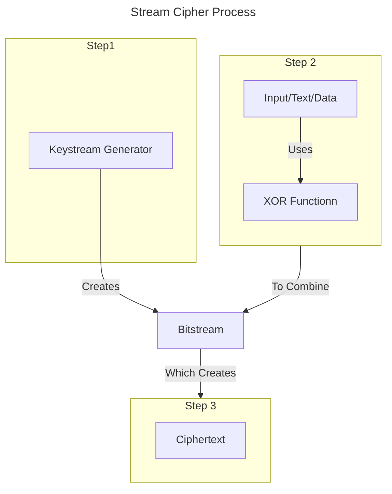
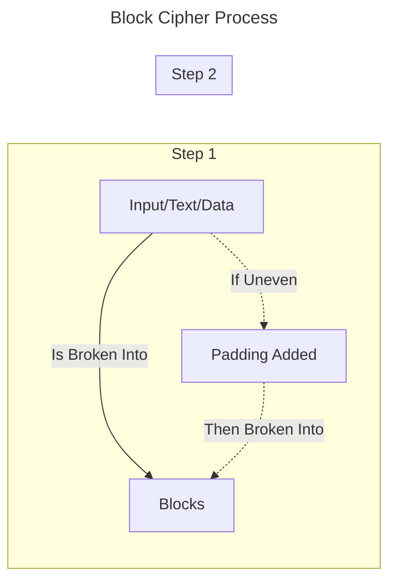

# About
---
- A [[Cryptography#Cipher|Cipher]] is either a [[#Symmetric]] or [[#Asymmetric]] [[Cryptography#Algorithm|Algorithm]] based on the [[Cryptography#Key]|Key]]

# Symmetric
---
- [[Disk Encryption#^501400|Encryption]] [[Cryptography#Algorithm|Algorithm]] in which both the sender and receiver must know the same secret using a privately held [[##secre using a privately held [[Cryptography#Key|Key]]
- One key used to encrypt data
- AKA Using a "Private Key" or "Secret Key"
- Can provide [[SecBasics#^25117d|Confidentiality]] but not [[#Nonrepudiation]] since anyone with the password/[[Cryptography#Key]|Key]] can interact with the data
- Symmetric can be 100 - 1000x faster depending on which [[Cryptography#Algorithm|Algorithm]] is used
- [[Cryptography#Algorithm|Algorithms]]
	- DES
	- 3DES
	- IDEA
	- [[Disk Encryption#Advanced Encryption Standard (AES)|AES]]
	- Blowfish
	- Twofish
	- RC4
	- RC5
	- RC6

```ad-example
title: Symmetric Encryption
collapse:close
![[SymmetricEx1.png]]
```

# Asymmetric
---
- [[Disk Encryption#^501400|Encryption]] [[Cryptography#Algorithm]|Algorithm]] where different [[Cryptography#Key|Keys]] are used to encrypt and decrypt data
- One key used to encrypt and another to decrypt
- AKA "Public Key" or "Public and Private Key Combo"
- [[Cryptography#Algorithm|Algorithms]]
	- [[WIFI Protected Access version 3 (WPA3)#TLS/Diffie-Hellman Key Exchange|Diffie-Hellman]]
	- RSA
	- ECC

```ad-example
title: Asymmetric Encryption
collapse:close
![[AsymmetricEx1.png]]
```

# Hybrid Implementation
---
- Utilizes [[#Asymmetric]] [[Disk Encryption#^501400|Encryption]] to securely transfer a private key that can be used with [[#Symmetric]] [[Disk Encryption#^501400|Encryption]] of the data

# Nonrepudiation
---
- The assurance that someone cannot deny the validity of something, where a statement’s author cannot dispute its authorship ^0b9f33
- Makes it difficult to successfully deny who and where a message came from as well as the authenticity and integrity of that message

# Cipher Types

## Stream Cipher
---
- [[#Symmetric]] [[Cryptography#Key|Key]] [[Cryptography#Cipher|Cipher]] in which plaintext digits are combined with a pseudorandom [[Cryptography#Cipher|Cipher]] digit stream known as a [[#^c3c51d|Keystream]]
- Utilizes a [[#^c3c51d|Keystream]] generator to create a [[#^d60611|Bitstream]] that is mixed with the input plaintext to encrypt data bit by bit using a mathematical XOR function which then creates the [[#^d56ba1|Ciphertext]]
- An encryption [[Cryptography#Algorithm|Algorithm]]
- Good for securing real time operations
- Generally [[#Symmetric]]
- Usually in [[Root of Trust#Hardware Security Module (HSM)|Hardware]] solutions
- See also
	- [[Cryptography#Cipher]]



## Block Cipher
---
- An encryption method that applies a deterministic [[Cryptography#Algorithm|Algorithm]] along with a [[#Symmetric]] [[Cryptography#Key|Key]] to encrypt a block of text instead of encrypting one bit at a time as in [[#Stream Cipher]]
- Breaks the input into fixed-length blocks of data and performs the encryption on each block
- Example
	- 1 KB file broken into 16 blocks of 64 bits
	- Each block is processed one at a time
- If the input does not break up into equally divided pieces "padding" is added to make it so
- Easier implementation, succumbs to less security problems, and easier to implement in applications
- See also
	- [[Cryptography#Cipher]]



- Ref
	- [Flowchart](https://mermaid.js.org/syntax/flowchart.html)
	- [Sequence](https://mermaid.js.org/syntax/sequenceDiagram.html)
	- [Journey](https://mermaid.js.org/syntax/userJourney.html)
	- [Pie](https://mermaid.js.org/syntax/pie.html)
	- [GitGraph](https://mermaid.js.org/syntax/gitgraph.html)
	- [Timeline](https://mermaid.js.org/syntax/timeline.html)

# Vocab
---
- Keystream
	- A stream of random or pseudorandom characters that are combined with a plaintext message to produce an encrypted message ^c3c51d
- Ciphertext
	- The result of [[#^c3c51d|Keystream]] output ^d56ba1
- Bitstream
	- A sequence of bits ^d60611

# Objectives
---
- [[Objectives#2.8 - Summarize the basics of cryptographic concepts|2.8 - Summarize the basics of cryptographic concepts]]

# TODO (Delete when done)
---
- [ ] Added vocab
- [ ] Added and linked objectives in document
- [ ] Linked objectives back to document
- [ ] Linked any relevant backlinks to and from document