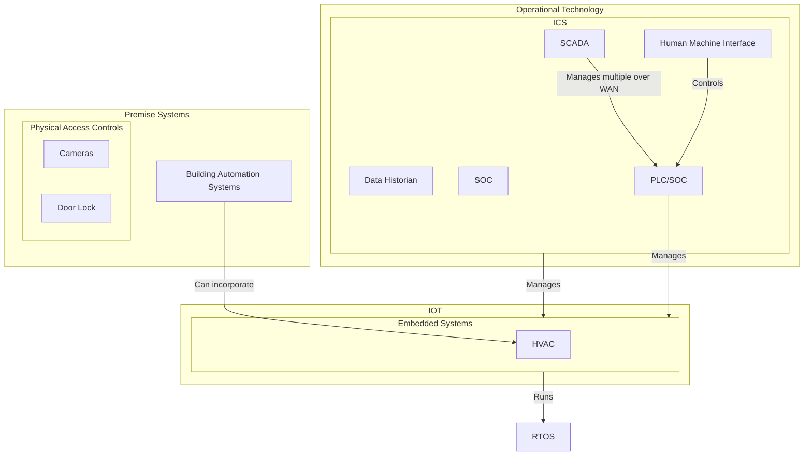

# [[Cloud Based Infrastructure]]
---
- Vendor Lock In ^d2ea95
	- Because of cost or another serious limitation you can be "forced" to stay with a vendor ^2f2cac
	- For example, you have a large amount of data and attempting to move to another provider could incur large expenses because of bandwidth or storage costs that would be required to migrate
-  On Premise pro
	- In your data center with physical access ^851f11
		- Ensures you maintain your [[SecBasics#^51b6d8|CIA]] and [[SecBasics#^45fffd|AAA]] security models

# ICS, SCADA, Premise System, etc. Difference
---

# Test
---
![[#ICS, SCADA, Premise System, etc. Difference]]

- Ref
	- [Flowchart](https://mermaid.js.org/syntax/flowchart.html)
	- [Sequence](https://mermaid.js.org/syntax/sequenceDiagram.html)
	- [Journey](https://mermaid.js.org/syntax/userJourney.html)
	- [Pie](https://mermaid.js.org/syntax/pie.html)
	- [GitGraph](https://mermaid.js.org/syntax/gitgraph.html)
	- [Timeline](https://mermaid.js.org/syntax/timeline.html)